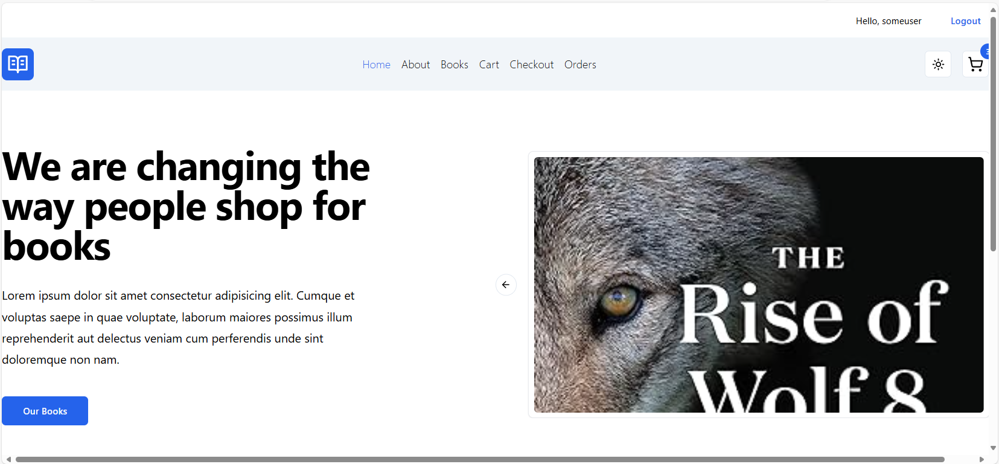
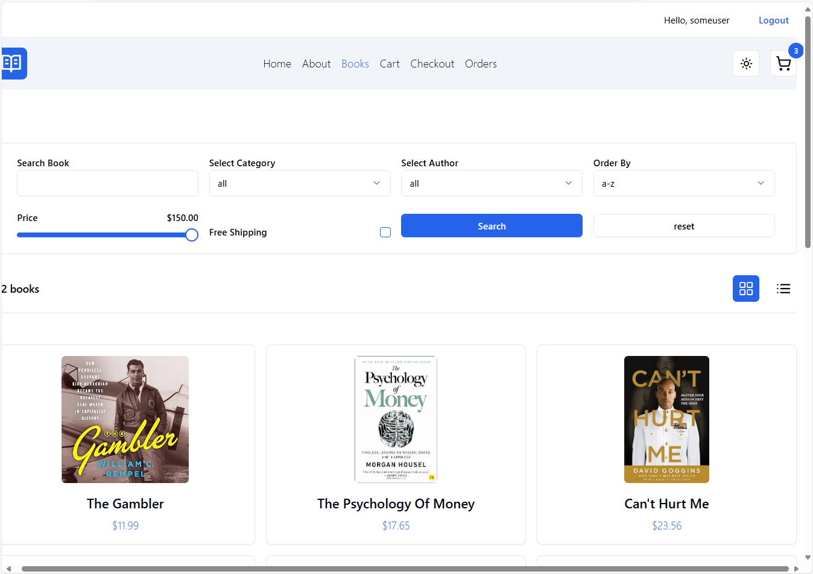
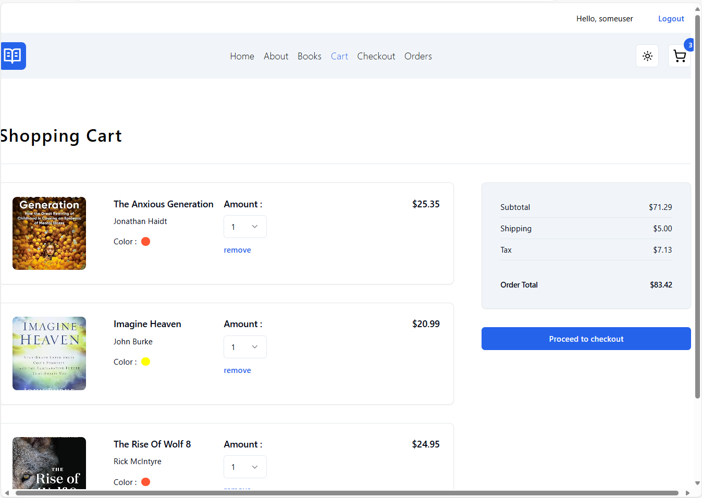
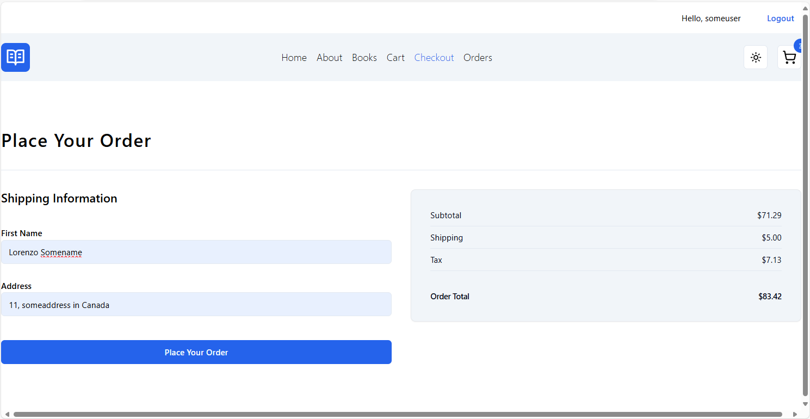

# BookStore #

Single Page REACT Application (SPA) written in Typescript with a C# MVC RESTful API using ASP.NET Core that connects to an MS SQL Server database with Entity Framework.

Swagger UI is used for API testing.

__Note:__ This application requires Node.js to be installed.

After cloning the Github repository you need to run the following:
1. To install the npm modules referenced in package.json run: npm install
2. Starting the application in development mode: npm run dev

At this point the Bookstore Single Page Application should load in the browser.

